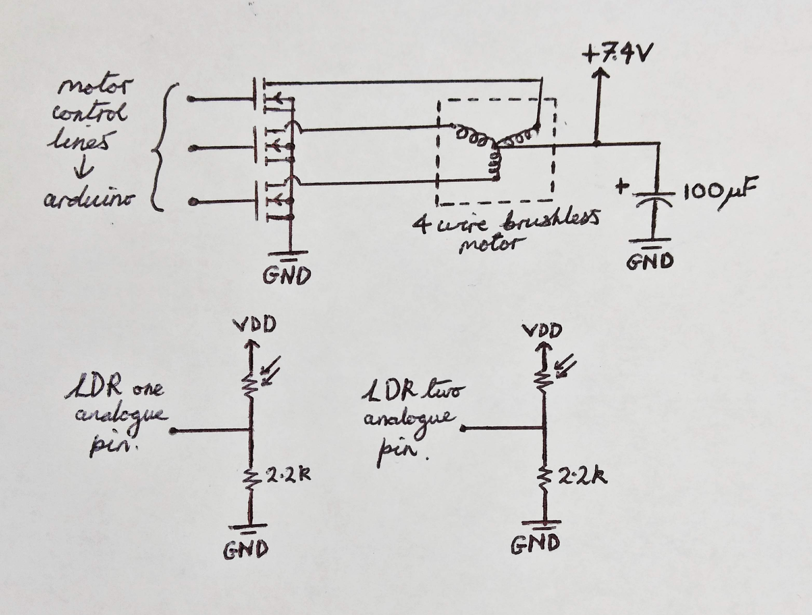

ADCS Demo
=========

#### An Attitude Determination and Control System (ADCS) demo.

Created for [Open Cosmos](https://www.open-cosmos.com/), this project uses off-the-shelf components to demonstrate the principle of operation of an ADCS.

---

### What is an ADCS?

This system is an essential component of most spacecraft. It is the general term for the hardware and software which keeps a satellite orientated in space.

Although the objective of an ADCS is common amongst all systems, the way this is achieved varies. The many different variations and their characteristics are summarised in [this NASA paper](https://ntrs.nasa.gov/archive/nasa/casi.ntrs.nasa.gov/20110007876.pdf).

### Reaction wheel as the actuator

A wide variey of actuator types can be used in an ADCS. For example: magnetic torquers, thrusters and reaction wheels. This demo uses a reaction wheel.

A reaction wheel works by spinning a wheel up to a high angular velocity, then applying a torque to change this velocity. Due to Newton's Third Law, the body must experience an equal and opposite torque to the wheel - accelerating it in the opposite direction. Alternatively, this could be thought of in terms of the [law of conservation of angular momentum](http://www.feynmanlectures.caltech.edu/I_18.html) if we assume no external torque on the system as a whole.

Through a PID feedback loop, this mechanism can precisely control the orientation of a spacecraft.

The sensor used as an input to this PID loop varies for real applications (e.g. Sun sensor, Earth sensor, Star Tracker, Magnetometer etc.). This demo was designed to track the position of a torch, so two light sensors are used; their difference in readings providing an error value to work with.

### Demo hardware specifics

Three reaction wheels would be required to orient in all three axis. For simplicity of design, this demo focusses on controlling the attitude in a singular axis. In order to do this, the demo is freely suspended by a piece of thread which isolates the vertical axis.

The demonstration consists of the following components:

Part | Component Type Used
--- | ---
Processor | Arduino Nano
Motor | Brushless DC from Hard Drive
Frame | 3D Printed; Designed in OpenScad
Power | Two 1S Lipos in Series (7.4V)
Light Sensors | LDRs

### Prototype

To verify that the above set of components would be appropriate, a prototype was built first ([video](https://photos.app.goo.gl/x1hWNtvbokYaZJKe7)). This used a breadboard to host the MOSFET power distribution, and a bench power supply instead of lipo batteries. It suceeded in proving that, amongst other things, the motor would be adequate.

### Pictures

Below are some pictures of the design process. For more images, see the `images` directory.

*Finished Demo*

*Circuit schematic* ([better diagram](https://xkcd.com/730/))

*Frame that fits the BeeKit interface; with cutouts.*

---

#### References, and further information:

- http://www.ece3sat.com/cubesatmodules/adcs/
- https://en.wikipedia.org/wiki/Attitude_control
- http://citeseerx.ist.psu.edu/viewdoc/download?doi=10.1.1.823.8473&rep=rep1&type=pdf
